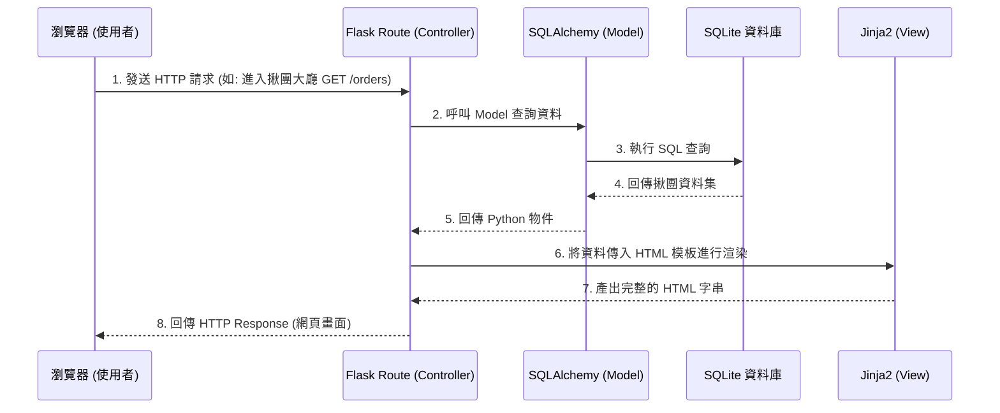

# 系統架構文件 (Architecture)

## 專案名稱：FCU-Foodster (逢甲專屬揪團平台)

---

## 1. 技術架構說明

本專案主要採用傳統的 **伺服器端渲染 (Server-Side Rendering, SSR)** 架構，並非前後端分離。透過 Flask 框架結合 Jinja2 模板引擎，可以快速開發並符合輕量級校園應用的需求。

### 選用技術與原因
- **後端框架**：**Python Flask**
  - **原因**：Flask 輕量、靈活，學習曲線平緩。對於本專案單純的揪團邏輯、表單提交等需求，不需過於肥大的框架即可快速建構 MVP。
- **模板引擎**：**Jinja2**
  - **原因**：內建於 Flask 中，能直接在 HTML 中嵌入 Python 變數與邏輯（如 `for` 迴圈顯示揪團清單、`if` 判斷付款狀態），無需額外配置複雜的前端框架（如 React / Vue）。
- **資料庫**：**SQLite (搭配 SQLAlchemy)**
  - **原因**：專案為校園規模的輕量應用，且部署容易，不需要架設獨立的資料庫伺服器，單一檔案即可滿足儲存需求。
- **前端技術**：**原生 HTML / CSS / JavaScript (搭配 Bootstrap 或 TailwindCSS 等輕量 UI 庫)**
  - **原因**：避免增加過多的前端打包負擔，專注於完成核心的表單與展示功能。

### Flask MVC 模式說明
雖然 Flask 本身是 Microframework，但我們將依循類似 **MVC (Model-View-Controller)** 的概念來組織程式碼：
- **Model (模型)**：負責與 SQLite 資料庫互動，定義資料表結構（如 User, GroupOrder, OrderItem），處理資料的儲存與查詢。
- **View (視圖)**：負責呈現使用者介面，這裡指的是 Jinja2 的 HTML 模板，負責將 Controller 傳遞過來的資料渲染成最終網頁。
- **Controller (控制器)**：在 Flask 中即為 `routes` (路由函式)。負責接收使用者的 HTTP 請求、呼叫 Model 取得或更新資料、並決定要回傳哪一個 View。

---

## 2. 專案資料夾結構

為了保持程式碼的可維護性，專案採用以下結構：

```text
FCU-Foodster/
│
├── app/                        # 應用程式主目錄
│   ├── __init__.py             # 初始化 Flask app 與資料庫連線
│   ├── models.py               # 資料庫模型 (Model) 定義 (User, GroupOrder 等)
│   ├── routes.py               # 路由與視圖邏輯 (Controller)
│   ├── forms.py                # (選擇性) 表單驗證類別 (如 Flask-WTF)
│   │
│   ├── static/                 # 靜態資源檔案
│   │   ├── css/                # 自訂樣式表
│   │   ├── js/                 # 前端互動邏輯
│   │   └── img/                # 圖片資源
│   │
│   └── templates/              # Jinja2 HTML 模板 (View)
│       ├── base.html           # 共用佈局 (導覽列、頁尾)
│       ├── auth/               # 登入與註冊頁面
│       │   ├── login.html
│       │   └── register.html
│       └── order/              # 揪團相關頁面
│           ├── list.html       # 揪團大廳
│           ├── create.html     # 發起揪團
│           └── detail.html     # 揪團詳細頁與點餐
│
├── instance/                   # 存放運行時產生的檔案 (不會進入版本控制)
│   └── foodster.db             # SQLite 資料庫檔案
│
├── docs/                       # 專案文件
│   ├── PRD.md                  # 產品需求文件
│   └── ARCHITECTURE.md         # 系統架構文件 (本文件)
│
├── requirements.txt            # Python 依賴套件清單
├── config.py                   # 全域設定檔 (資料庫路徑、Secret Key 等)
└── run.py                      # 程式進入點 (執行此檔案啟動伺服器)
```

---

## 3. 元件關係圖

以下展示使用者如何透過瀏覽器與系統互動的資料流：



---

## 4. 關鍵設計決策

1. **採用伺服器端渲染 (SSR) 而非 API + 前端框架**
   - **原因**：為了在有限的時間內完成 MVP（最小可行性產品），將前後端狀態整合在 Flask 中管理能大幅降低開發與除錯成本，且對於 SEO 和初步的效能需求已足夠。
2. **內建 SQLite 作為資料儲存**
   - **原因**：本平台初期只服務逢甲校內學生，資料量與並行存取量不會達到需要 PostgreSQL/MySQL 的等級。SQLite 可以直接打包在專案內，方便開發、測試與未來的輕量級部署。
3. **整合 SQLAlchemy ORM**
   - **原因**：不直接寫 SQL 語法，改用 ORM (Object-Relational Mapping) 管理資料庫。能提高程式碼可讀性，未來如果因為流量增加需要轉換至 PostgreSQL，也只需要更改連線字串，不需要重寫業務邏輯。
4. **模組化路由與模板**
   - **原因**：將視圖拆分為 `auth` (身分驗證) 與 `order` (揪團相關) 目錄，並使用 `base.html` 繼承機制，讓未來如果需要擴充「店家管理」或「個人中心」等功能時，能有清晰的擴展架構。
