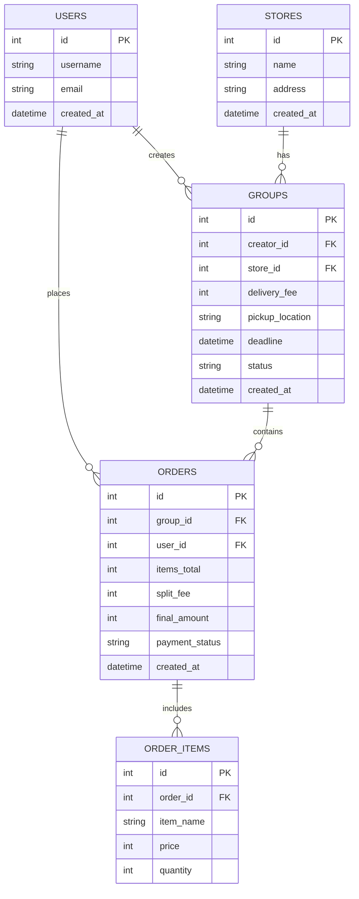

# 資料庫設計文件 (DB Design)

本文件描述逢甲「食」客 (FCU Foodie Hub) 專案 F-02 模組（揪團與訂單拆帳）的資料庫設計。

## 1. ER 圖（實體關係圖）

## 2. 資料表詳細說明

### `users` (使用者)
儲存系統使用者的基本資訊。
- `id` (INTEGER PK): 唯一識別碼。
- `username` (TEXT): 使用者名稱/學號。
- `email` (TEXT): 電子郵件。
- `created_at` (DATETIME): 建立時間。

### `stores` (店家)
儲存周邊店家的基本資訊。
- `id` (INTEGER PK): 唯一識別碼。
- `name` (TEXT): 店家名稱。
- `address` (TEXT): 店家地址。
- `created_at` (DATETIME): 建立時間。

### `groups` (揪團主檔)
紀錄每一次的揪團發起資訊與規則。
- `id` (INTEGER PK): 揪團編號。
- `creator_id` (INTEGER FK): 發起人，關聯至 `users.id`。
- `store_id` (INTEGER FK): 目標店家，關聯至 `stores.id`。
- `delivery_fee` (INTEGER): 總外送費，此筆費用將會在結單時平攤給所有參團者。
- `pickup_location` (TEXT): 取餐地點，例如「圖書館」。
- `deadline` (DATETIME): 結單/收單時間。
- `status` (TEXT): 狀態，可為 `open` (開放中), `closed` (已結單), `completed` (已完成)。
- `created_at` (DATETIME): 建立時間。

### `orders` (個人訂單主檔)
紀錄某個揪團中，單一使用者的帳務與付款狀態。
- `id` (INTEGER PK): 訂單編號。
- `group_id` (INTEGER FK): 所屬揪團，關聯至 `groups.id`。
- `user_id` (INTEGER FK): 參團使用者，關聯至 `users.id`。
- `items_total` (INTEGER): 純餐費總計（所有 `order_items` 的單價 × 數量總和）。
- `split_fee` (INTEGER): 平攤的外送費（由後端拆帳邏輯計算後填入）。
- `final_amount` (INTEGER): 最終應付金額（`items_total` + `split_fee`）。
- `payment_status` (TEXT): 付款狀態，可為 `unpaid` (未付款), `paid` (已付款)。
- `created_at` (DATETIME): 建立時間。

### `order_items` (訂單明細檔)
紀錄單張訂單內具體點了哪些餐點。
- `id` (INTEGER PK): 明細編號。
- `order_id` (INTEGER FK): 所屬訂單，關聯至 `orders.id`。
- `item_name` (TEXT): 品項名稱（如「大麥克套餐」）。
- `price` (INTEGER): 單價。
- `quantity` (INTEGER): 數量。
